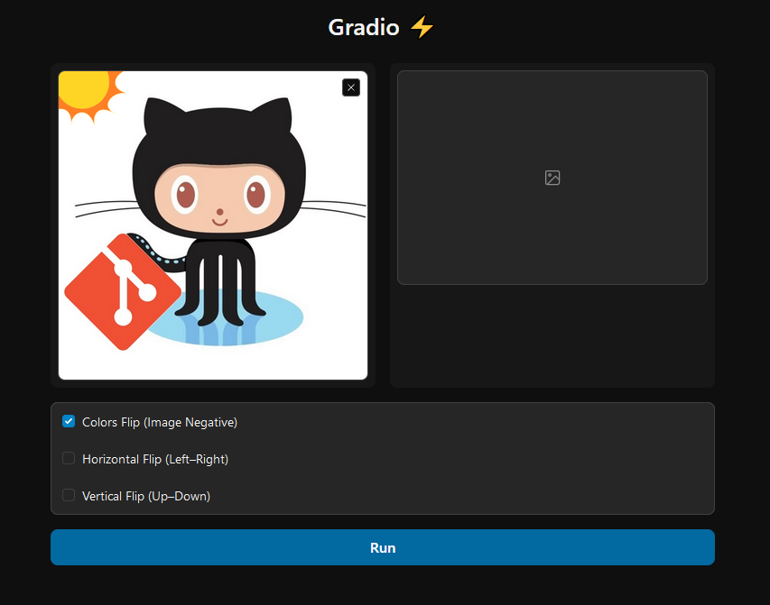

# [gradio-image-flip](https://github.com/kenny-kvibe/gradio-image-flip)

> Run a Gradio Web-UI to flip an image horizontally, vertically or by color.

### Installation

*Requires Python 3*

```sh
pip install -r requirements.txt
```

---

### Usage

1. Open a terminal and run command:

```sh
python main.py
```

2. Open a browser and enter URL:

```
http://127.0.0.1:7860
```

---

### Preview



---

<sub><u>UPDATED</u>: 09.Nov.2023</sub>
